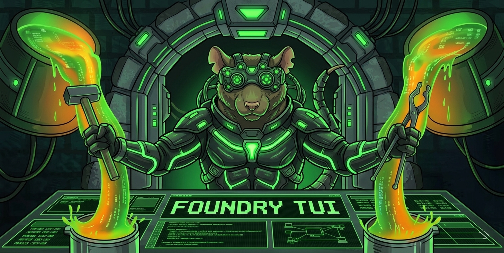

# Foundry TUI

A keyboard-first Rust TUI for Foundry users with live jobs, workflow tabs, command palette, and streaming logs.



## Quick Install (1 command only)

```bash
cargo install foundry-tui --locked && foundry-tui
```

Best Practice: Run it from any Foundry project directory:

```bash
cd /path/to/your/foundry-project
foundry-tui
```

## Features

- Dense dashboard layout with tabs for `Build`, `Test`, `Script`, `Anvil`, `Cast`, `Verify`, `Builder`, `Logs`, `History`
- Async job manager for concurrent Foundry commands with cancellation support
- Native CLI execution for `forge`, `cast`, `anvil`, `chisel`, `foundryup`
- Multi-instance Anvil management with per-instance live blockchain log panes
- Includes baked-in Across RPC presets from your provided chain list (no runtime API fetch)
- Forge Command Builder with preset picker, full `forge ...` paste parser, form-based field editing, and preview/confirm flow
- Global + project template loading (`~/.config/foundry-tui/templates.toml` + `./.foundry-tui/templates.toml`)
- Secret placeholders are masked in form/preview/logs
- Sensitive CLI values (private keys / API keys / 32-byte hex secrets) are redacted from job command previews and history
- `cast block-number` now logs the target chain, preset key, and RPC URL before execution
- Shows loaded Solidity file inventory + Foundry context in workspace dashboards
- Keymap + workflow command customization via TOML config
- Single high-contrast `bold-contrast` color system with minimal log styling
- Command palette (`Ctrl+P`) with predefined workflow actions

## Development from Source (contributors)

```bash
git clone https://github.com/KanishkKhurana/foundry-tui.git
cd foundry-tui
cargo run
```

The first run creates config at:

```text
~/.config/foundry-tui/config.toml
```

And bootstraps global custom command templates at:

```text
~/.config/foundry-tui/templates.toml
```

Across chain RPC presets are available as `across-<chain>-<chainId>` keys (for example `across-ethereum-1`) and are enabled by default.

## Default Keybinds

- `q`: quit
- `tab` / `backtab`: cycle tabs
- `ctrl+p`: open command palette
- `b`: forge build
- `t`: forge test
- `s`: forge script
- `x`: forge command builder
- `c`: cast block number
- `v`: forge verify check
- `h`: chisel list
- `u`: foundryup update
- `a`: open anvil launch form
- `shift+a`: stop anvil
- `up` / `down`: scroll focused section
- mouse wheel: scroll focused section (or command palette list)
- mouse move: auto-focus pane under cursor
- `f2`: toggle mouse interaction mode (use text selection mode when you need to copy terminal text)
- `ctrl+j` / `ctrl+k`: focus next/previous section

In the `Anvil` tab, `up` / `down` selects which instance is focused.  
Pressing `a` opens a prompt for instance `name`, `port`, optional `fork URL`, and `extra flags` (for example `--chain-id 31337 --block-time 1`).

All major panels are independently scrollable (Main, Jobs, Logs, Anvil Instances, Anvil Logs).  
Mouse capture is enabled while the TUI is open for hover + wheel support.  
When you need native terminal selection, press `F2` to switch to selection mode, then `F2` again to return to interactive mouse mode.

## Secret Safety Notes

- The UI/history/log preview path redacts sensitive-looking values to reduce accidental key exposure.
- Any secret passed to external tools as a process argument can still be visible to local OS process inspection while that process is running.
- Prefer env-based auth supported by Foundry (`ETH_PRIVATE_KEY`, etherscan key envs, etc.) when possible, instead of raw CLI arguments.

## Workflow Command Overrides

Edit `foundry.workflows` in the config file to set project-specific command args.

Example:

```toml
[foundry]
profile = "default"
default_rpc_preset = "across-ethereum-1"

[foundry.workflows]
build = ["build"]
test = ["test", "-vvv"]
script = ["script", "script/Deploy.s.sol:DeployScript", "--sig", "run()", "--broadcast"]
cast_block_number = ["block-number"]
verify_check = ["verify-check", "YOUR-GUID"]
chisel_list = ["list"]
foundryup_update = ["--update"]
anvil_start = ["--port", "8545"]
```

## Forge Builder Presets

Global presets live at `~/.config/foundry-tui/templates.toml`.  
Project presets (optional) live at `./.foundry-tui/templates.toml` and override global presets with the same `id`.

Built-in presets now include:
- `forge-build`
- `forge-test`
- `forge-script-broadcast`
- `forge-verify-check`
- `forge-verify-contract`

Example:

```toml
[[templates]]
id = "forge-script-increment"
label = "Forge Script Increment"
tool = "forge"
args_template = [
  "script",
  "{{script_target}}",
  "--rpc-url",
  "{{rpc_url}}",
  "--broadcast",
  "--sig",
  "{{signature}}",
  "{{deployer_private_key}}",
  "{{counter_addr}}",
  "-vv",
]

[templates.params.script_target]
default = "script/Increment.s.sol:IncrementScript"
kind = "string"

[templates.params.deployer_private_key]
secret = true
kind = "hex"

[templates.params.counter_addr]
kind = "address"
```

In the forge builder modal:
- choose preset or paste a full forge command (`forge ...`)
- fill a single form (`RPC Preset`, `Raw Args Tail`, template fields)
- optional template fields are explicitly tagged as `[optional]`
- add optional raw args tail (raw flags override template flags)
- confirm masked preview, then run

## Quality Checks

```bash
cargo fmt --all
cargo clippy --workspace --all-targets -- -D warnings
cargo test --workspace
```
